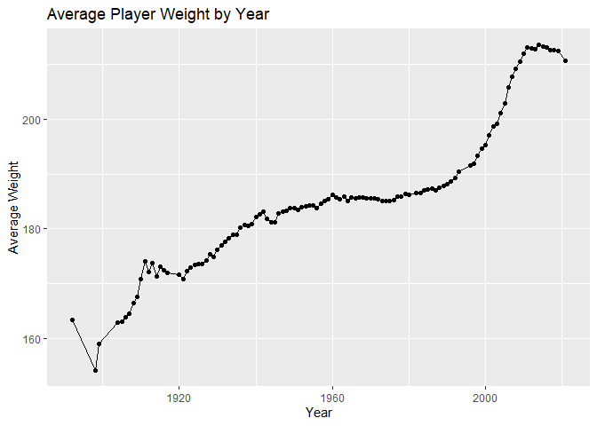

Baseball Data Analysis
================
Brady Biehn
2025-08-29

``` r
library(tidyverse)
```

    ## Warning: package 'tidyverse' was built under R version 4.4.2

    ## Warning: package 'ggplot2' was built under R version 4.4.2

    ## Warning: package 'tibble' was built under R version 4.4.2

    ## Warning: package 'tidyr' was built under R version 4.4.2

    ## Warning: package 'readr' was built under R version 4.4.2

    ## Warning: package 'purrr' was built under R version 4.4.2

    ## Warning: package 'dplyr' was built under R version 4.4.2

    ## Warning: package 'stringr' was built under R version 4.4.2

    ## Warning: package 'forcats' was built under R version 4.4.2

    ## Warning: package 'lubridate' was built under R version 4.4.2

    ## ── Attaching core tidyverse packages ──────────────────────── tidyverse 2.0.0 ──
    ## ✔ dplyr     1.1.4     ✔ readr     2.1.5
    ## ✔ forcats   1.0.0     ✔ stringr   1.5.1
    ## ✔ ggplot2   3.5.1     ✔ tibble    3.2.1
    ## ✔ lubridate 1.9.4     ✔ tidyr     1.3.1
    ## ✔ purrr     1.0.2     
    ## ── Conflicts ────────────────────────────────────────── tidyverse_conflicts() ──
    ## ✖ dplyr::filter() masks stats::filter()
    ## ✖ dplyr::lag()    masks stats::lag()
    ## ℹ Use the conflicted package (<http://conflicted.r-lib.org/>) to force all conflicts to become errors

``` r
library(ggfortify)
```

    ## Warning: package 'ggfortify' was built under R version 4.4.2

``` r
data <- read_csv("Baseball.csv")
```

    ## Rows: 2407 Columns: 11
    ## ── Column specification ────────────────────────────────────────────────────────
    ## Delimiter: ","
    ## chr (2): teamID, team_name
    ## dbl (9): yearID, wins, losses, running_average_wins, avg_weight, avg_height,...
    ## 
    ## ℹ Use `spec()` to retrieve the full column specification for this data.
    ## ℹ Specify the column types or set `show_col_types = FALSE` to quiet this message.

``` r
head(data, 10)
```

    ## # A tibble: 10 × 11
    ##    yearID teamID team_name           wins losses running_average_wins avg_weight
    ##     <dbl> <chr>  <chr>              <dbl>  <dbl>                <dbl>      <dbl>
    ##  1   2021 ARI    Arizona Diamondba…    52    110                   73       209.
    ##  2   2021 ATL    Atlanta Braves        88     73                   92       210.
    ##  3   2021 BAL    Baltimore Orioles     52    110                   51       210.
    ##  4   2021 BOS    Boston Red Sox        92     70                   95       212.
    ##  5   2021 CHA    Chicago White Sox     93     69                   76       215.
    ##  6   2021 CHN    Chicago Cubs          71     91                   83       210.
    ##  7   2021 CIN    Cincinnati Reds       83     79                   75       209.
    ##  8   2021 CLE    Cleveland Indians     80     82                   88       206.
    ##  9   2021 COL    Colorado Rockies      74     87                   79       217.
    ## 10   2021 DET    Detroit Tigers        77     85                   63       216.
    ## # ℹ 4 more variables: avg_height <dbl>, roster_size <dbl>,
    ## #   avg_games_played <dbl>, median_games_played <dbl>

``` r
data %>%
    group_by(yearID) %>%
    summarize(avg_weight = mean(avg_weight, na.rm = TRUE)) %>%
    ggplot(aes(x = yearID, y = avg_weight)) +
    geom_point() +
    geom_line() +
    labs(x = "Year", y = "Average Weight", title = "Average Player Weight by Year")
```

<!-- -->
